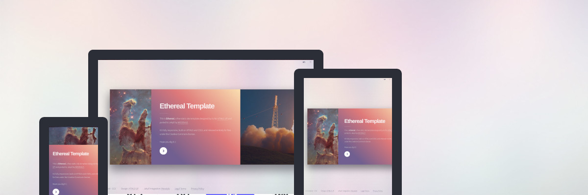

# Ethereal - Jekyll theme

> A Jekyll version of the "Ethereal" theme by [HTML5 UP][html5up].

You can preview the theme [here](https://apehex.github.io/jekyll-theme-ethereal



# Features

> **Responsive**: out of the box support for all screen sizes, be it smartphones, laptops, tablets...

> **Multilingual**: easily manage pages, menu, url, dates, sitemap in several languages

> **Customizable**: theme colors, header, banner, menu, social items can be changed from a central config file

> **Many page templates**: contact forms, navigation menus, and others can be easily inserted thanks to custom Jekyll includes

> **Vector images**: the theme images are vectorized, render smoothly on any display and can be dynamically styled

> **GDPR ready**: bundled with a cookie consent plugin and a boilerplate privacy policy compliant with GDPR

> **SEO ready**: sitemap, robots.txt and tags are automatically generated for the website

# Installation

Add this line to your Jekyll site's `Gemfile`:

```ruby
gem "jekyll-theme-ethereal"
```

And add this line to your Jekyll site's `_config.yml`:

```yaml
theme: jekyll-theme-ethereal
```

And then execute:

    $ bundle

Or install it yourself as:

    $ gem install jekyll-theme-ethereal

# Usage

For those unfamiliar with how Jekyll works, check out [jekyllrb.com](https://jekyllrb.com/) for all the details, 
or read up on just the basics of [front matter](https://jekyllrb.com/docs/frontmatter/), [writing posts](https://jekyllrb.com/docs/posts/), 
and [creating pages](https://jekyllrb.com/docs/pages/).

## Configuration

You can use the following custom parameters in `_config.yml`.

### Site
Both `title` and `subtitle` are displayed side by side :
- in the tab name
- at the top of the page, in the header

### Social
Social icons will appear for each url your fill in, among `facebook_url` etc.

### Contact
Your contact information can be used in contact forms, the footer or anywhere else.

## Publication

### On Github Pages

In your own website's repository, edit the `_config.yml` file:

```yaml
url: "https://<github-account-name>.github.io/<repository-name>"
```

Build the website with:

    $ JEKYLL_ENV=production bundle exec jekyll build

Commit all your work to the current branch.

Create a branch named `gh-pages`:

    $ git checkout -b gh-pages

And finally replace the repository's content with the generated webpages:

    $ mkdir ~/backup
    $ mv ./* ~/backup/
    $ mv ~/backup/.git ./
    $ mv ~/backup/_site/* ./
    $ git add .
    $ git commit -m "First draft"

The repository's content is backup in the home directory of the user.

And finally push to github

    $ git push --u origin gh-pages

### On any server

In your own website's directory, edit the `_config.yml` file:

```yaml
url: "https:<domain-name>"
```

Build the website with:

    $ JEKYLL_ENV=production bundle exec jekyll build

Copy the content of the folder `_site` to your server, most likely in `www`.

If necessary, configure your server to serve this directory.

# Contributing

Bug reports and pull requests are welcome on GitHub at https://github.com/apehex/jekyll-theme-ethereal. This project is intended to be a safe, welcoming space for collaboration, and contributors are expected to adhere to the [Contributor Covenant][contributor-covenant] code of conduct.

# Development

To set up your environment to develop this theme, run `bundle install`.

Your theme is setup just like a normal Jekyll site! To test your theme, run `bundle exec jekyll serve` and open your browser at `http://localhost:4000`. This starts a Jekyll server using your theme. Add pages, documents, data, etc. like normal to test your theme's contents. As you make modifications to your theme and to your content, your site will regenerate and you should see the changes in the browser after a refresh, just like normal.

When your theme is released, only the files in `_layouts`, `_includes`, `_sass` and `assets` tracked with Git will be bundled.
To add a custom directory to your theme-gem, please edit the regexp in `jekyll-theme-ethereal.gemspec` accordingly.

# Credits

Original README from HTML5 UP:

```
Ethereal by HTML5 UP
html5up.net | @ajlkn
Free for personal and commercial use under the CCA 3.0 license (html5up.net/license)


This is Ethereal, my latest, greatest, and quite possibly most unique template for HTML5 UP.
Since releasing Parallelism 3-4 years ago (!!!), I've been dying to do another side-scrolling
template with more in the way of flexibility/customization potential. The result is this template,
Ethereal, which combines a robust side-scrolling framework of my own creation (with various
"scroll-assist" features like drag/momentum scrolling, keyboard shortcuts, etc.) with a unique
look and feel, a lightbox gallery, tons of customization options, and, of course, full
responsiveness. Hope you dig it :)

Demo images* courtesy of Unsplash, a radtastic collection of CC0 (public domain) images
you can use for pretty much whatever.

(* = not included)

AJ
aj@lkn.io | @ajlkn


Instructions:

	Overview
	========

		Browsers deal with side-scrolling pages differently to vertically-oriented ones in
		that they require elements (or at the very least, the top-most wrapper element) to
		have a defined (fixed) width. This leads to a number of limitations (eg. the page
		won't automatically grow/shrink in the same way a vertically-oriented one will), so
		Ethereal does two things to work around this:

		- The entire page is made up of "panel" elements, each of which can be assigned an
		  optional "size" modifier (satisfying the fixed width requirement).

		- For panels that don't use a size modifier, individual containing elements *inside*
		  them (eg. a column) can be assigned a "span" modifier to give those a fixed width
		  instead (also satisfying the fixed width requirement).

		Another fun quirk of side-scrolling pages is how to actually implement horizontal
		scrolling *without* resorting to using the (usually ugly) horizontal scrollbar.
		Ethereal does this in FOUR (!) ways:

		- Dragging: Users can simply click and drag the page left or right to scroll it around.
		  This works exactly as you'd expect, and even has a nice "post-scroll momentum" effect.

		- Scroll Wheel: Ethereal modifies* the scroll wheel's behavior to translate vertical
		  scrolling into horizontal scrolling, allowing the user to use either the scroll wheel
		  or trackpad to scroll the page (the latter of which retains the ability to horziontally
		  scroll as normal, so nothing changes there).

		  * Special thanks to @miorel + @pieterv of Facebook for "normalizeWheel()" :)

		- Scroll Zones: Users can hover the mouse cursor on the left or right edges of the page
		  to automatically scroll in either direction.

		- Keyboard Shortcuts: Finally, users can simply use the left/right arrows, page up/down,
		  home/end, and the spacebar to scroll the page.

		Note that any (or all) of these scroll-assist features can be turned off (and in some
		cases customized). See the top of assets/js/main.js for more information.


	Span Modifiers
	==============

		Span modifiers are simply classes that give elements a fixed width, the size of which
		is determined by the "unit value" associated with the modifier (eg. "span-3" means
		"span 3 units"). These sizes are in "rem" units when used inside panels that don't
		use a size modifier, and in percentage units when used inside panels that do.

		Ethereal includes span modifiers ranging from 0.25 units ("span-0-25") to 10 units
		("span-10"). Here's a partial list:

		span-0-25     Span 0.25 units.
		span-0-5      Span 0.5 units.
		span-0-75     Span 0.75 units.
		span-1        Span 1 unit.
		span-1-25     Span 1.25 units.
		span-1-5      Span 1.5 units.
		span-1-75     Span 1.75 units.
		...
		span-9        Span 9 units.
		span-9-25     Span 9.25 units.
		span-9-5      Span 9.5 units.
		span-9-75     Span 9.75 units.
		span-10       Span 10 units.


	Major Elements
	==============

		Most of Ethereal's elements are pretty much what you'd expect, but there are a handful
		of "major" ones that warrant a bit more explanation:


		Panel
		------

			The primary building block of Ethereal.

			HTML

				<section class="panel (size modifier) (color modifier)">
					<div class="intro (color modifier)">
						(intro content)
					</div>
					<div class="inner (inner modifiers) (color modifier)">
						(inner content)
					</div>
				</section>

				Note: The entire "intro" child element can be excluded.
				Note: You can have as many "intro" and "inner" child elements as you like.

			Modifiers

				Size

					small          Use small size.
					medium         Use medium size.
					large          Use large size.

				Color

					color0         Use background color 0 (gradient).
					color1         Use background color 1.
					color2         Use background color 2.
					color3         Use background color 3.
					color4         Use background color 4.
					color1-alt     Use background color 1 (alt).
					color2-alt     Use background color 2 (alt).
					color3-alt     Use background color 3 (alt).
					color4-alt     Use background color 4 (alt).

				Inner

					columns        Divides child elements into columns.
					aligned        When used with "columns", aligns content to top of panel.
					divided        When used with "columns", separates each column with a vertical line.

			Examples

				Here's a very basic example:

					<section class="panel medium color0">
						<div class="intro">
							<h2 class="major">Panel</h2>
							<p>Just a generic panel.</p>
						</div>
						<div class="inner">
							<p>Lorem ipsum dolor sit amet.</p>
						</div>
					</section>

				And here's a more advanced example using columns and *no* size modifier:

					<section class="panel color2">
						<div class="intro">
							<h2 class="major">Panel</h2>
							<p>Just a generic panel.</p>
						</div>
						<div class="inner columns">
							<div class="span-4">
								<p>This column is 4 units wide.</p>
							</div>
							<div class="span-3">
								<p>This column is 3 units wide.</p>
							</div>
							<div class="span-2">
								<p>This column is 2 units wide.</p>
							</div>
						</div>
					</section>

				Note: The "intro" child element already has a fixed width, so a span modifier
				isn't required.


		Panel (Banner)
		--------------

			The "Banner" variant of a regular panel.

			HTML

				<section class="panel banner (size modifier) (color modifier) (orientation modifier)">
					<div class="content (color modifier)">
						(content)
					</div>
					<div class="image (image modifiers)" data-position="(image position modifier)">
						
					</div>
				</section>

			Modifiers

				Orientation

					left           Content on the left, image on the right.
					right          Content on the right, image on the left.

				Image

					filtered       Applies a gradient filter to the image.
					tinted         Applies a tint filter to the image.

				Image Position (required)

					top left       Position image in the top-left corner.
					top            Position image along the top edge.
					top right      Position image in the top-right corner.
					right          Position image along the right edge.
					bottom right   Position image in the bottom-right corner.
					bottom         Position image along the bottom edge.
					bottom left    Position image in the bottom-left corner.
					left           Position image along the left edge.
					center         Position image in the center.

			Example

				<section class="panel banner medium right">
					<div class="content color0">
						<h1>Banner</h1>
						<p>Lorem ipsum dolor sit amet.</p>
					</div>
					<div class="image" data-position="center">
						
					</div>
				</section>


		Panel (Spotlight)
		-----------------

			The "Spotlight" variant of a regular panel.

			HTML

				<section class="panel spotlight (size modifier) (orientation modifier)">
					<div class="content (span modifier)">
						(content)
					</div>
					<div class="image (image modifiers)" data-position="(image position modifier)">
						
					</div>
				</section>

			Modifiers

				Orientation

					left           Content on the left.
					right          Content on the right.

				Image

					filtered       Applies a gradient filter to the image.
					tinted         Applies a tint filter to the image.

				Image Position (required)

					top left       Position image in the top-left corner.
					top            Position image along the top edge.
					top right      Position image in the top-right corner.
					right          Position image along the right edge.
					bottom right   Position image in the bottom-right corner.
					bottom         Position image along the bottom edge.
					bottom left    Position image in the bottom-left corner.
					left           Position image along the left edge.
					center         Position image in the center.

			Example

				<section class="panel spotlight large right">
					<div class="content">
						<h1>Spotlight</h1>
						<p>Lorem ipsum dolor sit amet.</p>
					</div>
					<div class="image" data-position="center">
						
					</div>
				</section>


		Gallery
		-------

			A lightbox-enabled gallery.

			HTML

				<div class="gallery">
					<a href="(full image URL)" class="image (image modifiers) (span modifier)" data-position="(image position modifier)">
						
					</a>
					<a href="(full image URL)" class="image (image modifiers) (span modifier)" data-position="(image position modifier)">
						
					</a>
					<a href="(full image URL)" class="image (image modifiers) (span modifier)" data-position="(image position modifier)">
						
					</a>
					<div class="group (span modifier)">
						<a href="(full image URL)" class="image (image modifiers) (span modifier)" data-position="(image position modifier)">
							
						</a>
						<a href="(full image URL)" class="image (image modifiers) (span modifier)" data-position="(image position modifier)">
							
						</a>
						<a href="(full image URL)" class="image (image modifiers) (span modifier)" data-position="(image position modifier)">
							
						</a>
						<a href="(full image URL)" class="image (image modifiers) (span modifier)" data-position="(image position modifier)">
							
						</a>
						...
					</div>
					...
				</div>

				Note: The "group" element creates a dual-row group of images. Images inside this group will
				automatically wrap to the next row when they exceed its width (as defined by its span modifier).
				You can have as many groups in a gallery as you like.

			Modifiers

				Image

					filtered       Applies a gradient filter to the image.
					tinted         Applies a tint filter to the image.

				Image Position (required)

					top left       Position image in the top-left corner.
					top            Position image along the top edge.
					top right      Position image in the top-right corner.
					right          Position image along the right edge.
					bottom right   Position image in the bottom-right corner.
					bottom         Position image along the bottom edge.
					bottom left    Position image in the bottom-left corner.
					left           Position image along the left edge.
					center         Position image in the center.

			Example

				<div class="gallery">
					<a href="/images/thumbnails/01.jpg" class="image filtered span-2" data-position="center">
						
					</a>
					<a href="/images/thumbnails/02.jpg" class="image filtered span-4" data-position="center">
						
					</a>
					<div class="group span-4">
						<a href="/images/thumbnails/03.jpg" class="image filtered span-2" data-position="center">
							
						</a>
						<a href="/images/thumbnails/04.jpg" class="image filtered span-2" data-position="center">
							
						</a>
						<a href="/images/thumbnails/05.jpg" class="image filtered span-2" data-position="center">
							
						</a>
						<a href="/images/thumbnails/06.jpg" class="image filtered span-2" data-position="center">
							
						</a>
					</div>
				</div>


Credits:

	Demo Images:
		Unsplash (unsplash.com)

	Icons:
		Font Awesome (fontawesome.io)

	Other:
		jQuery (jquery.com)
		normalizeWheel (@miorel + @pieterv of Facebook)
		Responsive Tools (github.com/ajlkn/responsive-tools)
```

Inspired by the similar ports made by [Andrew Banchich][andrew-banchich].

Uses the basic template from the [cookie consent plugin][cookieconsent].

Demo images courtesy of NASA.

Repository [Jekyll logo][jekyll-logo] icon licensed under a [Creative Commons Attribution 4.0 International License][cc4-license].

## License

The theme is available as open source under the terms of the [CC-BY-3.0](LICENSE).

[andrew-banchich]: https://gitlab.com/andrewbanchich
[cc4-license]: http://choosealicense.com/licenses/cc-by-4.0/
[contributor-covenant]: http://contributor-covenant.org
[cookieconsent]: https://github.com/osano/cookieconsent
[html5up]: https://html5up.net/
[jekyll-logo]: https://github.com/jekyll/brand
